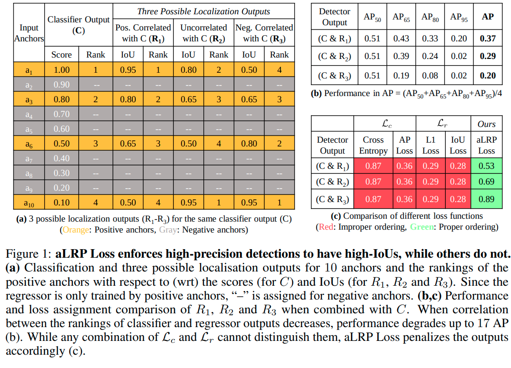

# aLRP Loss: A Ranking-based, Balanced Loss Function Unifying Classification and Localisation in Object Detection

Average Localisation-Recall-Precision (aLRP) Loss is a ranking-based loss function to train object detectors by unifying localisation and classification branches. We define aLRP Loss as the average [Localisation Recall Precision](https://arxiv.org/abs/1807.01696) [1] values on positive examples. To tackle the nondifferentiable nature of ranking during backpropagation, we combine error-driven update of perceptron learning with backpropogation by generalizing the training approach of AP Loss [2] to ranking-based loss functions (see Section 4 in the paper for details). 

With this formulation, aLRP Loss (i) enforces the predictions with large confidence scores to have better localisation, and correlates the classification and localisation tasks (see Figure), (ii) has significantly less number of hyperparameters than conventional loss formulation (only 1 hyperparameter compared to around 6), and (iii) guarantees balanced training (see Theorem 2 in the paper).



This repository provides the implementation of aLRP Loss based on [official AP Loss repository](https://github.com/cccorn/AP-loss). In short, a more-efficient mmdetection-based implementation with a diverse set of models trained by aLRP Loss will be released. 

Please cite the paper if you benefit from our paper or repository:
```
@inproceedings{aLRPLoss,
       title = {A Ranking-based, Balanced Loss Function Unifying Classification and Localisation in Object Detection},
       author = {Kemal Oksuz and Baris Can Cam and Emre Akbas and Sinan Kalkan},
       booktitle = {Advances in Neural Information Processing Systems (NeurIPS)},
       year = {2020}
}
```
## Specification of Dependencies
- Python 3.7
- PyTorch 1.2+
- CUDA 10.0
- NumPy 1.16+
- [mmcv](https://github.com/open-mmlab/mmcv)


## Training Code
You can train a model by running the following code:

```
python train.py --cfg PATH_TO_CONFIG_FILE
```
The configuration files are in the `config` folder. We provide all the configuration files used for comparison with SOTA methods in Table 4:
```
- aLRPLoss500_r50.py
- aLRPLoss500_r50_ATSS.py
- aLRPLoss500_r101.py
- aLRPLoss500_x101.py
- aLRPLoss800_r101.py
- aLRPLoss800_x101.py
```
Also using our code, the results of AP Loss can be reproduced with the following configuration files:
```
- APLoss500_r50.py
```

## Test Code
You can test a model by running the following code on "test-dev2017" or "val2017" of COCO splits.

```
python test.py --cfg PATH_TO_CONFIG_FILE
```
In addition to standard COCO-style performance metrics, our evaluation code reports APs for every IoU to compute COCO-Style AP, and also oLRP.
## Results of the Base Models (w Scale 500)

|    Method     |  Backbone   | oLRP (minival) | AP (minival) | Download  |
| :-------------: | :-----: | :------------: | :------------: | :-------: |
|    AP Loss    |  ResNet-50  |   71.0   |   35.5  | [model](https://drive.google.com/file/d/1_RJdIlPrVLdSwlEWfD5M-k1MrWSkZ-Wi/view?usp=sharing)|
|    aLRP Loss  | ResNet-50 |   68.4  |   38.9   | [model](https://drive.google.com/file/d/1I7_T4zwvc-ncMlMWNbqRZ2TgzstU7svs/view?usp=sharing)|
|    aLRP Loss + ATSS   | ResNet-50 |   67.3   |   40.2  | [model](https://drive.google.com/file/d/1oRquKgfsYPUA3OZYpL6Hn2Yw0VQm9_Mg/view?usp=sharing)|

## Table of Main Results with Pretrained Models

|    Backbone     |  Scale   | oLRP (minival) | AP (minival) | AP (test-dev) | Download  |
| :-------------: | :-----: | :------------: | :------------: | :----: | :-------: |
|    ResNet-101    |  500  |   66.1   |   41.2   |  41.7  | [model](https://drive.google.com/file/d/1ihhXuh49_PeGkfldo9LoD7GXWTi-ZaNc/view?usp=sharing)|
| ResNext-101-32x8d    | 500 |   64.8  |   42.8   |  43.4  | [model](https://drive.google.com/file/d/1NKFu0gxjEPbyFvYzTFppYrZHBeo4XIis/view?usp=sharing)|
|    ResNet-101   | 800 |   64.5   |   43.6   |  44.1  | [model](https://drive.google.com/file/d/1vymO5NeUTSHX2ZYWYtiJv-80T4FtSmAp/view?usp=sharing)|
| ResNext-101-32x8d | 800  |   62.7   |   45.4   |  45.9  | [model](https://drive.google.com/file/d/1gCrjqCc9i5-A4y-R6Xxbfpv1DiAH41Fy/view?usp=sharing)|

### Preparation Instructions:

- Install required packages:
```
pip install "git+https://github.com/open-mmlab/cocoapi.git#subdirectory=PythonAPI"
pip install opencv-python
```
- Create necessary directories:
```
mkdir data models results
```
- Prepare Data: You can download the images and their annotations from [the download page of COCO dataset](http://cocodataset.org/#download). Please do not forget to change the name of the downloaded `test` folder name as `test-dev2017`. If you have had the dataset, then just create a symbolic link to yours by:
```
ln -s $YOUR_PATH_TO_coco data/coco
```
Finally, the data directories should be arranged like:
```
├── data
│   ├── coco
│   │   ├── annotations
│   │   ├── train2017
│   │   ├── val2017
│   │   ├── test-dev2017
```
- Prepare the pre-trained backbone models under `models` directory by following the structure below:
```
├── models
│   ├── resnet50-pytorch.pth
|   ├── resnet101-pytorch.pth
|   ├── resnext101_32x8d-8ba56ff5.pth
```
We use ResNet-50 and ResNet-101 pre-trained models provided by the official AP-Loss repository. Accordingly, you can download them from [this link](https://1drv.ms/u/s!AgPNhBALXYVSa1pQCFJNNk6JgaA?e=PqhsWD). For ResNext-101, we use the model provided by Pytorch [in this link](https://download.pytorch.org/models/resnext101_32x8d-8ba56ff5.pth) to download.


## References
[1] Oksuz K, Cam BC, Akbas E, Kalkan S, Localization recall precision (LRP): A newperformance metric for object detection, ECCV 2018.
[2] Chen K, Li J, Lin W, See J, Wang J, Duan L, Chen Z, He C, Zou J, Towards Accurate One-Stage Object Detection With AP-Loss, CVPR 2019 & TPAMI.
